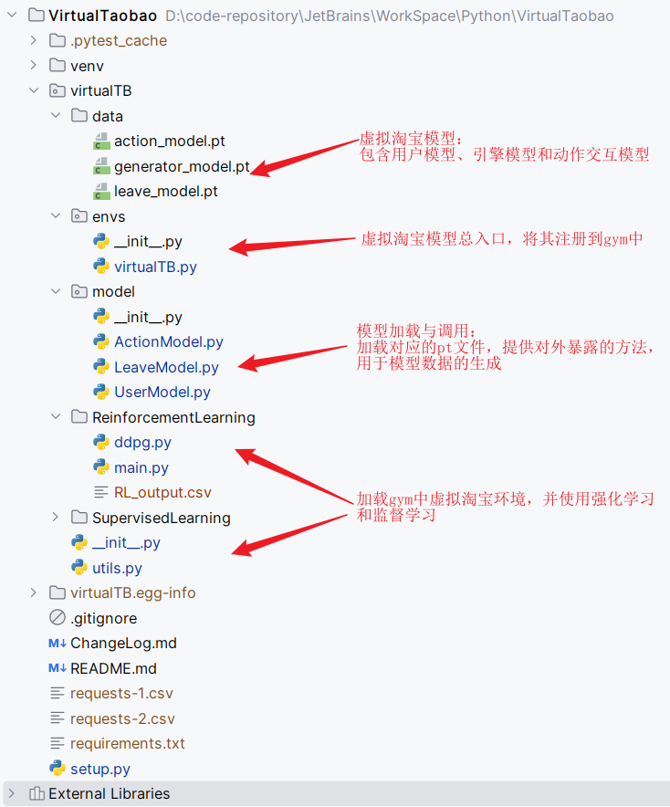
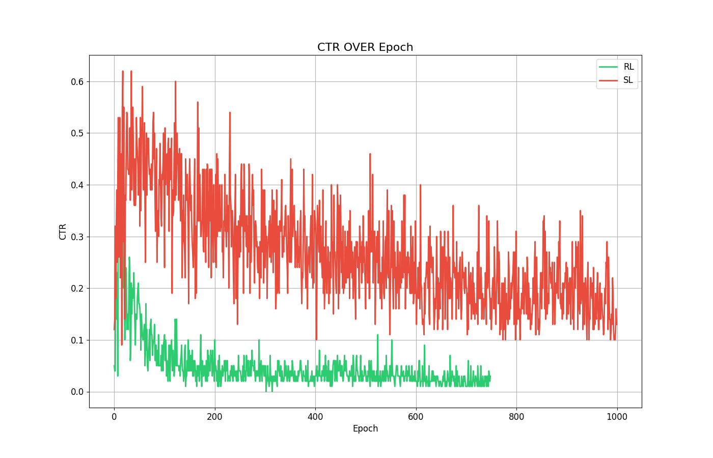

# VirtualTaobao

在[淘宝](http://taobao.com)中，当客户输入一些查询时，系统会根据查询和客户档案返回一个项目列表。该系统预计会返回一个好的列表，以便客户有很高的机会点击项目。

使用VirtualTaobao模拟器，可以访问一个“实时”环境，就像真实的淘宝环境一样。虚拟客户将一次生成一个，虚拟客户启动查询，推荐系统需要返回项目列表。虚拟客户将会像真实客户一样决定是否要单击列表中的项目。


复现的虚拟淘宝论文信息如下
> Jing-Cheng Shi, Yang Yu, Qing Da, Shi-Yong Chen, and An-Xiang Zeng. [Virtual-Taobao: Virtualizing real-world online retail environment for reinforcement learning](https://arxiv.org/abs/1805.10000). In: Proceedings of the 33rd AAAI Conference on Artificial Intelligence (AAAI’19), Honolulu, HI, 2019. 

我们这个代码库中发布了一个VirtualTaobao模型，用于强化学习研究和模拟环境构建研究（请参阅下面的监督学习和强化学习用例）。

### 模拟环境

VirtualTaobao模拟客户，项目和推荐系统。
* 一个客户与11个静态属性和3维动态属性相关联，其中一个静态属性被热编码为88个二进制维度。这里，static/dynmaic意味着在交互过程中特性是否会发生变化。关于的属性信息涉及客户年龄、客户性别、客户浏览历史等。
* 一个项目与27个维度属性相关联，这些属性表示价格、销售量、CTR等。（对于置信度问题，项目集内容不公开。）

系统和客户之间的交互过程如下
1. 虚拟淘宝对客户的特征向量进行采样，包括客户的描述和客户的查询。
2. 系统根据查询检索一组相关项目，形成整个项目集。
3. 系统使用模型来分配与项目属性相对应的权重向量。
4. 系统计算产品

在上述过程中，步骤3中的模型将被训练。该模型输入客户和项目集的特征，并输出27维的权重向量。该权重向量将用于计算项目的分数，以便对项目进行排序。

### 部署要求

下表是复现代码运行的环境配置和基本说明。

| 编程语言        | Python                                      |
|-----------------|---------------------------------------------|
| 软件平台        | Windows11操作系统；PyCharm；                |
| 硬件环境        | 12核Intel i7 CPU；32GB内存；240GB 固态硬盘  |
| 其他说明        | Python>3.11; gym>=0.10.5; torch>=0.4.0 。    |
|                 | 虚拟淘宝是基于PyTorch进行训练和开发的。模型训练完成之后注册到Gym中，并利用DDPG提高的强化学习代理进行实验验证。 |


### 项目整体结构

在对上面的算法进行具体的复现之后，之后我们进行训练生成模型，然后将模型保存起来构成一个虚拟淘宝供外部调用，项目代码的整体结构如下图所示：



根据上面复现的算法，我们构建了用于生成用户特征的用户模型 `generator.pt` 文件、根据用户特征生成返回页的引擎模型 `leave_model.pt` 文件、用于动作生成的 `action_model.pt` 文件。然后我对这三个pt文件编写了对应的类保存在model包中。它们加载pt文件并向外提供模型生成的数据。data包和model包共同构成了虚拟淘宝的基本架构。之后在envs包中将这个自定义的环境注册到gym中。在后续的实验环境搭建中，利用gym将其加载出来，作为环境，提供给DDPG代理和RL来进行对比性实验。

### 监督学习用例

在监督学习用例中，我们提供了一个数据集，该数据集包含客户特征、项目特征、标签和点击次数。数据集的准备如下所示 ：

```
virtualTB/SupervisedLearning/dataset.txt
```

数据集的每一行都包含一个特征实例、标签和点击次数，用制表符分隔。

要从数据集训练模型，以下代码将使用PyTorch进行演示：

```
virtualTB/SupervisedLearning/main.py
```
main.py包含了从数据集加载、模型训练到模型测试的完整过程。

### 强化学习用例

在强化学习用例中，我们提供了一个强化学习环境，该环境包含客户特征、项目特征和标签。环境的准备如下所示 ：

```python
import gym
import virtualTB

env = gym.make('VirtualTB-v0')
print(env.action_space)
print(env.observation_space)
print(env.observation_space.low)
print(env.observation_space.high)
state = env.reset()
while True:
    env.render()
    action = env.action_space.sample()
    state, reward, done, info = env.step(action)
    
    if done: break
env.render()
```

作为一个使用DDPG强化学习算法和PyTorch的更完整的例子，我们提供了以下代码：
```
virtualTB/ReinforcementLearning/main.py
```
main.py包含了从数据集加载、模型训练到模型测试的完整过程。

### 实验结果

本实验主要是验证利用在虚拟淘宝中训练出来的策略可以有明显优于传统的监督方法的在线性能。结果如下图所示：



我们可以看到，DDPG在该虚拟环境中的CTR（点击通过率）在很短的时间内就实现了收敛。也就是说，在该环境中训练的代理能够很快地推荐出让用户满意的结果，使得点击率快速下降并收敛。借助该虚拟环境的训练，相比于监督学习，强化学习能更短时间内实现更好的效果，在线性能更优异。
